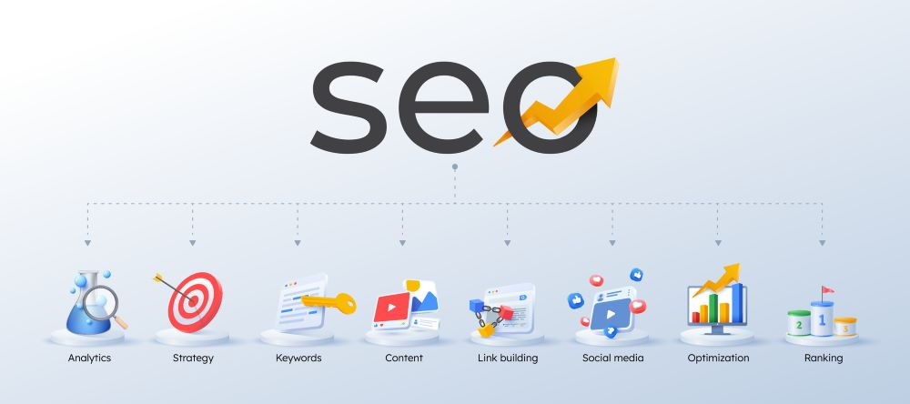

<!-- Project Banner Image -->

<p align="center">
  
</p>

# SEO Tools 🔍📈

<p align="center">
  <strong>Smart Keyword Research & SERP Clustering Toolkit</strong><br>
  <em>Find, analyze, and cluster keywords based on real-time Google results — like a pro.</em>
</p>

---

## 🚀 Technologies Used


---

## 📌 About The Project

**SEO Tools** is a smart toolkit designed for digital marketers, SEO experts, and content strategists.
It helps users:

* Extract relevant **keywords** from any topic or seed phrase
* Automatically fetch **Google SERP results** for each keyword
* Cluster keywords into **semantic groups** based on similarity in search results
* Generate structured keyword strategies for better content targeting

> No more guesswork. Use data-driven clustering to guide your content.

---

## 🎯 Features

* 🔎 **Keyword Extraction** from seed topics
* 🌐 **Live Google SERP Crawling** per keyword
* 🧠 **Semantic Clustering** of similar keywords based on overlapping SERP content
* 📊 Generate **grouped keyword strategies** automatically
* 🧱 Modular Django-based architecture with clean API
* 🔐 JWT-secured endpoints and Swagger API docs
* 🐳 Fully Dockerized for fast deployment

---

## 📂 Project Structure

```
seo_tools/
├── keyword/         # Keyword extraction and clustering logic
├── serp/            # Google SERP crawling module
├── api/             # DRF API layer
├── core/            # Shared utilities & base settings
├── scripts/         # Automation scripts
├── docker/          # Docker configurations
└── ...
```

---

## ⚠️ Challenges Solved

* Handling rate limits and captcha detection in Google scraping
* Designing meaningful clustering logic using SERP similarity
* Balancing speed vs. accuracy in real-time keyword research
* Modularizing logic across Django apps for scalability
* Deploying easily across environments using Docker

---

## 🛠️ How to Run This Project

Run the project in one of two ways:

---

### ✅ Method 1: Using Docker (Recommended)

1. Make sure PostgreSQL is up and running (locally or remotely).
2. Create DB and user credentials (matching `.env` variables).
3. Pull and run the image:

```bash
docker pull rezabm50/seo_tools:latest
docker run -p 8000:8000 --rm -it seo_tools
```

4. Enter environment variables when prompted or accept defaults.

---

### 🧪 Method 2: Manual Setup (For Development)

1. Clone the repository:

```bash
git clone https://github.com/yourusername/seo_tools.git
cd seo_tools
```

2. Install dependencies:

```bash
pip install -r requirements.txt
```

3. Set up environment variables:

```bash
cp .env.example .env
python init_env.py
```

4. Apply migrations:

```bash
python manage.py makemigrations
python manage.py migrate
```

5. Create superuser:

```bash
python manage.py createsuperuser
```

6. Run the server:

```bash
python manage.py runserver 0.0.0.0:8000
```

---

## 🔍 Example Use Case

1. Submit a topic:
   *e.g.* `"healthy breakfast ideas"`

2. System will:

   * Extract keyword variations
   * Query Google for top results per keyword
   * Analyze similarity across SERPs
   * Group keywords into intent-based clusters
   * Return structured clusters via API

---

## 📄 License

Licensed under the MIT License. See the [LICENSE](LICENSE) file for details.

---

## 🙌 Thank You!

Thanks for checking out **SEO Tools**.
This project is built with ❤️ for developers, marketers, and SEO professionals who believe in **data over guesswork**.

> Contributions, stars, and feedback are welcome!

---

<p align="center">
  
</p>
